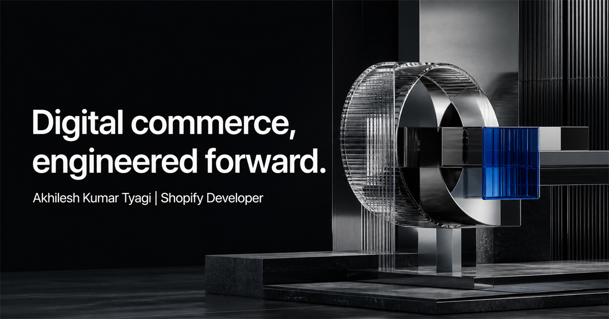

<div align="center">
  

  # Akhilesh Kumar Tyagi

  ### Shopify & Ecommerce Developer · UI/UX · Full-Stack Engineering

  I build distinctive, responsive storefronts where strong commerce architecture meets thoughtful interaction design.

  [](#run-locally)
  [](https://www.linkedin.com/in/akhilesh-kumar-tyagi-34286012a/)
  [](mailto:tyagiakhliesh87@gmail.com)
</div>

<br />



## Storefronts with a point of view

This repository contains my interactive developer portfolio: a recruiter-friendly showcase of real ecommerce work, live-store previews, resilient image fallbacks, case-study routes, and a design system built around clarity and motion.

The experience is intentionally more than a gallery. It demonstrates how I approach storefront storytelling, responsive implementation, interaction polish, performance-aware fallbacks, and maintainable frontend architecture.

## Selected commerce work

<table>
  <tr>
    <td width="33.33%" valign="top">
      <a href="https://www.mynamerings.com/">
        
      </a>
      <h3>My Name Rings</h3>
      <p>Personalized jewelry storefront focused on considered presentation and product discovery.</p>
      <a href="https://www.mynamerings.com/">Visit storefront ↗</a>
    </td>
    <td width="33.33%" valign="top">
      <a href="https://soleparfum.myshopify.com/">
        
      </a>
      <h3>Sole Parfum</h3>
      <p>Premium fragrance experience with a clear journey from discovery to product.</p>
      <a href="https://soleparfum.myshopify.com/">Visit storefront ↗</a>
    </td>
    <td width="33.33%" valign="top">
      <a href="https://bytestyleshop.com/">
        
      </a>
      <h3>Byte Style Shop</h3>
      <p>Characterful ecommerce presentation for gaming culture, electronics and PC products.</p>
      <a href="https://bytestyleshop.com/">Visit storefront ↗</a>
    </td>
  </tr>
</table>

The full portfolio includes ten projects across jewelry, fragrance, gaming, pets, sports, hospitality, commercial services, travel, and nutrition.

## What makes the experience different

- **Live storefront previews** with reliable screenshot fallbacks when external security policies block embedding.
- **Scroll-led project storytelling** that keeps featured work visible while recruiters explore each store.
- **Dedicated case-study routes** with consistent navigation back to the main portfolio.
- **Responsive motion system** built with reduced-motion support and deliberate section entrances.
- **Original visual direction** combining editorial portraiture, spatial commerce artwork, and an acid-lime design language.
- **Deployment-ready structure** prepared for Vercel today and a Supabase-backed content workflow later.

## Technology

<p>
  
  
  
  
  
  
  
  
</p>

| Layer | Implementation |
| --- | --- |
| Interface | Next.js, React, TypeScript |
| Motion | Motion for React, scroll progress, staged reveals |
| Visual system | Responsive CSS, Geist Sans, Geist Mono, Phosphor icons |
| Content | Typed local project collection, prepared for future Supabase integration |
| Data layer | Drizzle ORM foundation |
| Build | Vinext and Vite |
| Deployment | Vercel-ready; Cloudflare tooling also included |

## Project structure

```text
app/
├── page.tsx                 # Main portfolio
├── portfolio-v4.css         # Visual and responsive system
├── work/[slug]/page.tsx     # Dynamic commerce case studies
├── resume/page.tsx          # Recruiter-friendly résumé
└── admin/page.tsx           # Content-management foundation

components/
├── PortfolioExperience.tsx  # Main interactive experience
└── CaseStorePreview.tsx     # Live/fallback storefront preview

content/projects.ts          # Typed portfolio project data
public/                      # Brand art, portraits and storefront captures
```

## Run locally

Requirements: Node.js 22.13 or newer.

```bash
git clone https://github.com/TyagiAkhilesh87/Portfolio.git
cd Portfolio
npm install
npm run dev
```

Then open `http://localhost:3000`.

### Production check

```bash
npm run lint
npm run build
npm run start
```

## Deploy to Vercel

1. Import this GitHub repository into Vercel.
2. Keep the framework configuration detected from the project.
3. Set `NEXT_PUBLIC_SITE_URL` to the production URL.
4. Deploy the `main` branch.

No online database is required for the current portfolio. Supabase can be connected later for project management, contact submissions, and authenticated admin workflows without changing the public presentation.

## Contact

**Akhilesh Kumar Tyagi**  
Greater Lucknow, Uttar Pradesh East, India — 226021

[LinkedIn](https://www.linkedin.com/in/akhilesh-kumar-tyagi-34286012a/) · [GitHub](https://github.com/TyagiAkhilesh87) · [Email](mailto:tyagiakhliesh87@gmail.com) · [WhatsApp](https://wa.me/918795943121)

---

<div align="center">
  <strong>Designed and engineered for thoughtful teams and ambitious commerce.</strong>
  <br />
  <sub>© 2026 Akhilesh Kumar Tyagi</sub>
</div>
